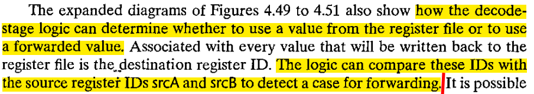

pipe-nobypass.hcl
```
word f_pc = [
	# Mispredicted branch.  Fetch at incremented PC
	# The valP of the jump instruction will be passed through
	# the stages (like together with the instruction) and turned 
	# into valA and reach memory stage pipeline register.
	M_icode == IJXX && !M_Cnd : M_valA;
	# Completion of RET instruction
	W_icode == IRET : W_valM;
	# Default: Use predicted value of PC
	1 : F_predPC;
];
```

Related chapter: 4.5.4, 4.5.8

What determines d_srcA? What is the logic of Select_A?
4.5.5 Avoiding Data Hazards by Forwarding 



```
word d_valA = [
	D_icode in { ICALL, IJXX } : D_valP; # Use incremented PC
	d_srcA == e_dstE : e_valE;    # Forward valE from execute
	d_srcA == M_dstM : m_valM;    # Forward valM from memory
	d_srcA == M_dstE : M_valE;    # Forward valE from memory
	d_srcA == W_dstM : W_valM;    # Forward valM from write back
	d_srcA == W_dstE : W_valE;    # Forward valE from write back
	1 : d_rvalA;  # Use value read from register file
];
```
When both d_srcA and one of the forward destination point to a same register ID, the forwarded value will take effect.

```
## What register should be used as the A source?
word d_srcA = [
	D_icode in { IRRMOVQ, IRMMOVQ, IOPQ, IPUSHQ  } : D_rA;
	D_icode in { IPOPQ, IRET } : RRSP;
	1 : RNONE; # Don't need register
];
Here `D_rA` is the register ID decoded from the instruction code.
```
